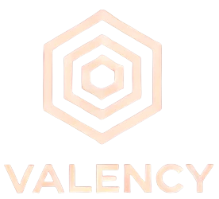

# VALENCY: UI and API Distribution for AI Implementation in Chemistry, Material Discovery and Simulations  



## Overview

This project provides a suite of tools for chemistry and material science. It combines robust backend APIs, efficient data engines, and a modern React frontend to deliver functionalities such as:

- **Property and Structure Exploration for Molecules, Polymers and Proteins**
- **Structural Similarity Search** using vector stores and RCSB API
- **Candidate Generations** via chemistry simulation and deep learning models
- **Interactive Chat Interface** powered by an LLM to navigate through the tools and services

## Features
The features have two layers:

- **Tool Layer** contains the tools to conduct various exploration, discrimination and generation tasks.
- **Automation Layer** contains the chatbot interface that assigns a LLM with reasoning and thinking capability to look into the tools available and suggest a sequntial pathway to follow to get a given scientific task.

The system is organized into three key components:

- **Backend:** FastAPI endpoints handling chat, queries, and tool orchestration.
- **Engine:** Core algorithms for vector storage, molecule generation, and chat formatting.
- **Frontend:** A React-based interface that renders responses with rich formatting and tool redirection.

## Installation

### Clone the Repository

```bash
git clone https://github.com/your-org/chemistry-api.git
cd chemistry-api
```

### Backend & Engine Setup
Ensure you are using Python 3.12. Create and activate a virtual environment, then install dependencies:

```bash
cd backend
python -m venv venv
source venv/bin/activate
pip install -r req.txt
```

### Frontend Setup
Install dependencies and start the React application:

```bash
cd ../frontend/app
npm install
npm start
```

### Running the Application
- Backend:
    Launch the API server with:

```bash
uvicorn main:app --host 0.0.0.0 --port 8000
```

- Frontend:
    Start the React app by running `npm start` from the app folder.

*Note - We are still working on finalizing some services. On completion of that phase we will make the Docker build available. We are planning to make a desktop app from the same codebase for windows and linux.*